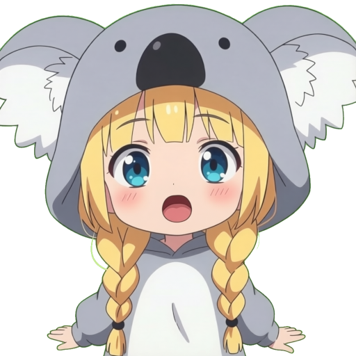
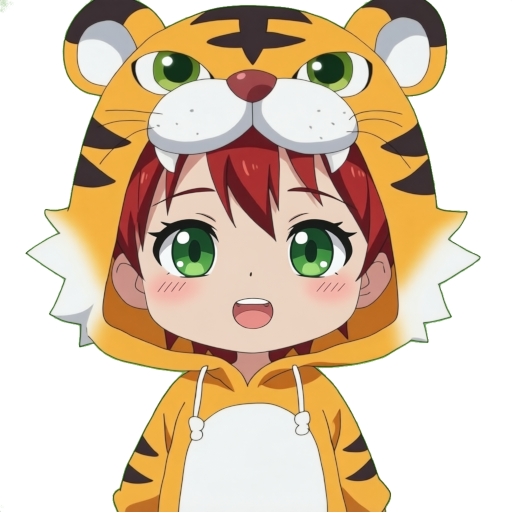
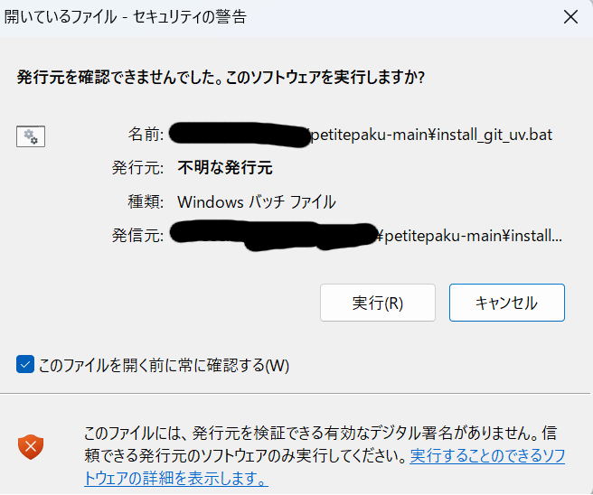
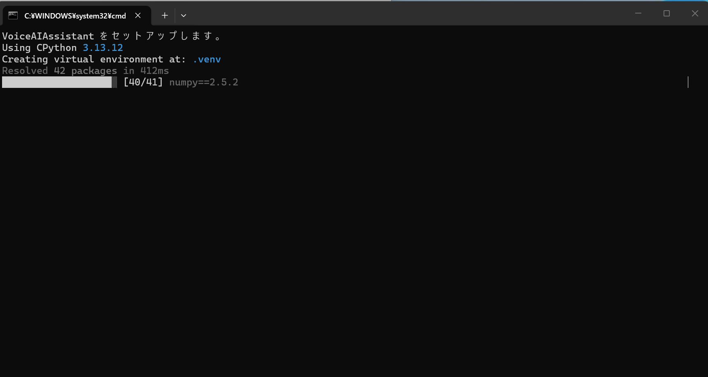
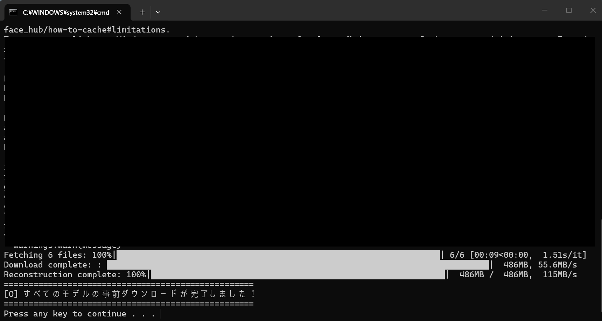
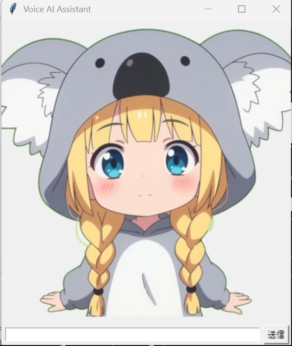
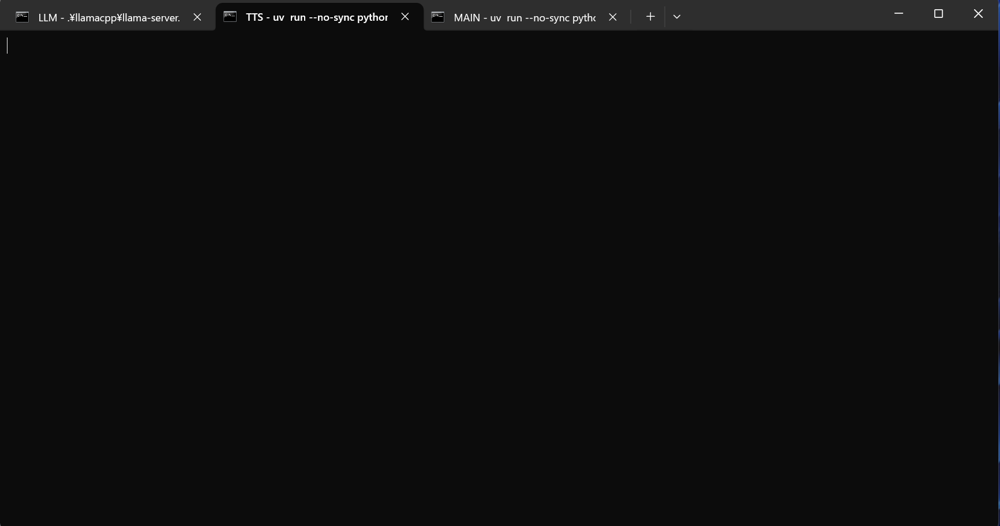
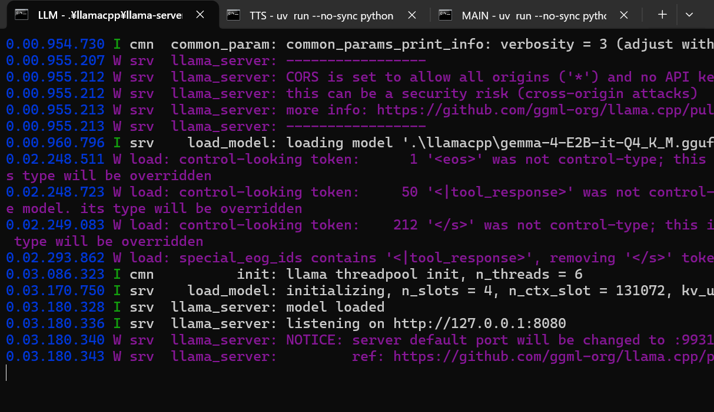
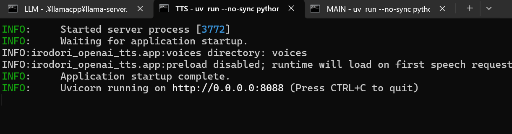

# ぷちパク
ぷちパクは 4 枚のキャラクタ画像と参照音声を元に LLM と音声認識 AI と音声合成 AI を連携することでキャラクタと対話する音声AIアシスタントです。

目と口を開けた画像(open_open.png)、目を開け口を閉じた画像(open_close.png)、目を閉じ口を開けた画像(close_open.png)、目と口を閉じた画像(close_close.png)の 4 枚の画像を再生音声の音量に合わせて切り替えて表示する、いわゆる PngTuber 技術と LLM実行環境 [llama.cpp](https://github.com/ggml-org/llama.cpp)、音声認識ツール[faster-whisper](https://github.com/SYSTRAN/faster-whisper)、音声合成ツール[Irodori-TTS-Server](https://github.com/Aratako/Irodori-TTS-Server)を組み合わせて実現しています。

プログラムは [Gemini](https://gemini.google.com/app)、標準キャラ画像は[ComfyUI](https://comfy.org/)で[Anima](https://huggingface.co/circlestone-labs/Anima)モデルで生成した画像を[Qwen Image Edit 2511](https://huggingface.co/Qwen/Qwen-Image-Edit-2511)モデルで編集、標準参照音声は[Emoji-TTS](https://github.com/iron-mukakin/Emoji-TTS) で作成しています。

同様のものはたくさんあると思いますが、AI で簡単に作れるので自分でもシステムを作ってみました。

## 実行例
標準キャラクタ
- 
- 

Windows + RTX 3060での実行例。音声合成に若干ラグがあります。Linux Fedora 44 + Radeon 7800XTだともっと反応が速いです。

https://github.com/user-attachments/assets/a273448a-ed01-48bb-924a-f6dc30e78a27

## ライセンス / License
このリポジトリの成果物は [CC0 1.0 全世界 (CC0 1.0) パブリック・ドメイン提供](https://creativecommons.org) のもとで公開されています。

著作権法上のすべての権利を放棄しているため、商用利用、改変、再配布を含め、いかなる目的でも許可なく自由に使用できます。

This project is licensed under the [CC0 1.0 Universal (CC0 1.0) Public Domain Dedication](https://creativecommons.org).

## 動作環境
それなりの性能の GPU が必要です。Windows + RTX 3060 と Linux Fedora 44 + Radeon 7800XT で動作確認しています。M4 Mac mini でも動くはずです。なお、メモリ 8GB の Macbook Neo は`Irodori-TTS-Server`だけでメモリが足らなくてスワップが発生するため性能的に無理です。

## インストールと実行
### Windows　用自動インストールツール(CUDA用)
Windows + Nvidia環境向けに自動インストール＆実行ツールを用意しています。

[リポジトリのコピーのZIPファイル](https://github.com/asfdrwe/petitepaku/archive/refs/heads/main.zip)をダウンロードして適当なフォルダで展開してください。

[Git](https://github.com/asfdrwe/petitepaku/archive/refs/heads/main.zip) と [uv](https://docs.astral.sh/uv/) がインストールされていない場合は、`install_git_uv.bat`を右クリックして管理者権限で実行してインストールしてください。`winget`を利用してインストールします。

次の警告画面が出る場合がありますが実行してください。


`setup.bat`をダブルクリックしてください。`uv`で必要な Python 環境を構築し、`Irodori-TTS-Server`を`git`でインストールし`uv`で必要な Python 環境を構築して参照音声を`Irodori-TTS-Server\voices`にコピーし、CUDA12.4 用 `llama.cpp` をダウンロードして実行環境を構築します。


`modeldownload.bat`をダブルクリックしてください。`.cache\huggingface` 以下に音声認識と音声合成に必要なモデルをダウンロードし、LLM として[Gemma4 E2B GGUF Q4_K_M](https://huggingface.co/unsloth/gemma-4-E2B-it-GGUF) をダウンロードします。両方合わせて 5GB 程度あります。

これでインストールが完了しました。


#### 実行
`run-tab.bat`をダブルクリックしてください。 LLM と Irodori-TTS-Server と MAIN の 3 つのタブを持つターミナルと、キャラクタが表示されて目パチするウィンドウが開かれるはずです。


SSDの速度によるのですが、LLM や Irodori-TTS-Server の起動に時間がかかる場合があります。

この状態ではまだ Irodori-TTS-Server が起動できていません。

LLM と Irodori-TTS-Server のタブを見てそれぞれ http://127.0.0.1:8080/ や http://0.0.0.0:8088/ の表示があるまで、待っていてください。



マイクで話しかけるか、キャラクタ画像の下の入力欄に会話内容を入れてEnterキーを押すか送信を推してください(マイクが見つからない場合は入力欄から文字で入力のみ可能になります)。数秒後に口パクをしながら音声で返答してくれるはずです。MAIN タブに音声認識内容や LLM の返答内容や 音声合成ツールの反応状況が表示されるので、参考にしてください。

おそらく、最初の会話だけ Irodori-TTS-Server の音声合成初期化処理が入るので30秒以上経っても音声再生されずタイムアウトになったり、なんか妙な失敗をすることもあるようですが、しばらくと待てば以後はこちらの入力に対して10秒以内には反応を返してくれるはずです。

### 手動でインストールする場合
macOS なら　[brew](https://brew.sh/)をインストールして uv をインストール(`brew install uv`)、Linuxならディストリビューションにしたがって git  や uv をインストールしてください。

`Git` でリポジトリをクローンし
```
git clone https://github.com/asfdrwe/petitepaku
```

`uv` で必要な環境を構築してください。
```
uv sync
```
(cudaの場合は)
```
uv sync --extra cuda
```

llama.cpp は macOS なら`brew install llama.cpp`でインストールできます。Linuxの場合は環境に合わせてビルドしてください。

Irodori-TTS-server は `git`でクローンして環境に合わせて`uv sync`してください。参照音声`chara1.wav`と`chara2.wav`が`voices`に入っているので、Irodori-TTS-serverのインストールフォルダの`voices`にコピーしてください。

LLM モデルをダウンロードしてください。Window自動インストールツールと同じモデルを使うなら[Gemma4 E2B Q4_K_M](https://huggingface.co/unsloth/gemma-4-E2B-it-GGUF/blob/main/gemma-4-E2B-it-Q4_K_M.gguf)です。

#### 実行
llama.cpp の `llama-server` を起動してください。
```
llama-server -m モデルのパス
```

`Irodori-TTS-Server` を起動してください。Windows 自動インストールツールと同じモデル(int8 weight only)を使うなら次のようにします。
```
export IRODORI_HF_CHECKPOINT=Aratako/Irodori-TTS-v4-Small-Quantized/int8-weight-only
uv run --no-sync python -m irodori_openai_tts --host 0.0.0.0 --port 8088
```

最後に PetitePaku を起動してください。
```
uv run --no-sync python main.py
```

## カスタマイズ
### キャラクタ画像
`chara1`フォルダを見てください。目を開け口を閉じた画像(open_close.png)、目を閉じ口を開けた画像(close_open.png)、目と口を閉じた画像(close_close.png)の 4 枚の画像が入っているので、別な画像に差し替えれば、その画像に変わります。

参照フォルダを変更したい場合は`main.py`の[21行目](https://github.com/asfdrwe/petitepaku/blob/3d77ddf0320ac92e9a9ec38ad699304c84bf2887/main.py#L21)を手で修正してください。

### 参照音声
Irodori-TTS-serverのインストールフォルダの`voices`に`chara1.wav`と`chara2.wav`が入っています。これを差し替えれば声質が変わります。

参照音声ファイル名を変えたい場合は、`main.py`の[36行目](https://github.com/asfdrwe/petitepaku/blob/3d77ddf0320ac92e9a9ec38ad699304c84bf2887/main.py#L36)を手で修正してください。

### システムプロンプト
LLM が返答する際の基本ルールをシステムプロンプトに設定します。標準では `main.py`の[40行目辺りから](https://github.com/asfdrwe/petitepaku/blob/3d77ddf0320ac92e9a9ec38ad699304c84bf2887/main.py#L40)で
```
    "あなたはゆうかという名前の小学生の女の子です。小学生らしい親身で楽しい会話をしましょう。"
    "感情を表すために文頭に絵文字で感情を表してください。"
    "【重要ルール】あなたは『ゆうか』のセリフだけを出力してください。自分の感情を回答に入れたり、相手の回答を作ったり、復唱したりしないでください。 "
    "1回につき、短文1文の返答だけを出力して、即座に出力を終了してください。"
    "絶対に次の行や会話を続けないでください。"
```
と指定しています。

これを変更すれば振る舞いが変わるので、変えたい場合は手で修正してください。

キャラクタ画像と参照音声とシステムプロンプトの変更例は `main.py` の対応箇所のすぐ下にchara2(男の子)用の例をコメントアウトして入れてあるので参考にしてください。

### LLM モデル
別の LLM モデルを使いたい場合は `run-tab.bat` の[10行目](
https://github.com/asfdrwe/petitepaku/blob/3d77ddf0320ac92e9a9ec38ad699304c84bf2887/run-tab.bat#L10)で指定しているので、差し替えてください。

手動で `llama-server` を動かしているなら`-m`オプションで指定するモデルを変えてください。

### LLM実行環境 と 音声合成ツール
llama-server と Irodori-TTS-Server は同じマシン(localhost)のポート 8080 と 8088 で動かすコードになっていますが、それぞれ別のマシンで動かしたい場合は、`main.py`の[34行目35行目](https://github.com/asfdrwe/petitepaku/blob/3d77ddf0320ac92e9a9ec38ad699304c84bf2887/main.py#L34)を手で修正してください。

OpenAI API 互換の他の LLM や音声合成ツールでも動くと思いますが確認していません。
